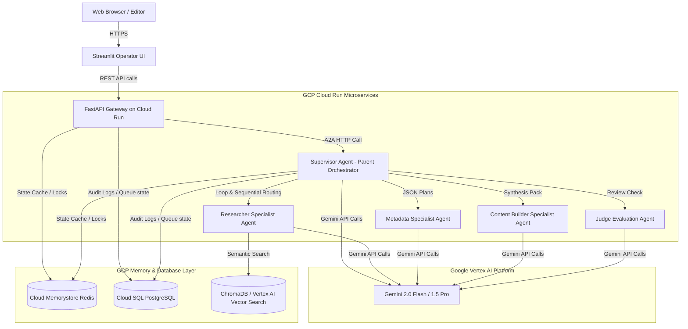

# AMC MediaOps Agentic Workflow Engine

A production-grade, multi-agent orchestration platform designed for the **Australian Media Channel (AMC)**. The system ingests raw editorial briefs, transcripts, and research notes, routes them through a Parent Orchestrator utilizing Google ADK, retrieves historical context using semantic vector archives, evaluates outputs through automated Judge criteria, and incorporates Human-in-the-Loop (HITL) checkpoints.

---

## 1. Architecture & Design

### Architecture Diagram
The diagram below maps the end-to-end serverless microservices layout deployed on Google Cloud Platform:



### Domain-Driven Design (DDD)
The platform is organized around distinct Bounded Contexts to isolate business domains and secure operational state:
1. **Content Ingestion Context**: Responsible for receiving diverse media formats (briefs, articles, raw radio transcripts) and cleaning them via sanitization filters.
2. **A2A (Agent-to-Agent) Orchestration Context**: The core orchestration block managed by the Supervisor Agent (Parent Orchestrator), executing sequential and loop patterns using the Google ADK.
3. **Pydantic Evaluation & Guardrails Context**: The compliance and quality assurance layer run by the Judge Agent, verifying outputs against structured schemas and corporate guidelines.
4. **HITL (Human-in-the-Loop) Approval Queue Context**: Manages state suspension and interactive modification forms for paused tasks.
5. **Audit & Observability Context**: Stores traces, system logs, tool calls, execution durations, and cost parameters in a relational store for analytical tracking.

### API-First & Microservices
Communication between microservices utilizes asynchronous A2A HTTP requests over GCP Cloud Run. FastAPI serves as the gateway routing engine:
* **`POST /api/submit`**: Accepts raw input and initiates background processing.
* **`GET /api/tasks` & `GET /api/tasks/{task_id}`**: Fetches active execution and detailed chronological trace snapshots.
* **`GET /api/review-queue`**: Retrieves tasks paused in `pending_review` state.
* **`POST /api/review/{task_id}`**: Submits approval or modification payloads, resuming workflow execution.

### Operator UI (Streamlit)
The frontend utilizes `st.session_state` to track active editor configurations and prevent state resets during updates. Heavy structural parameters (like backend connection configurations) are optimized using `@st.cache_resource`. Execution progress triggers real-time UI polling loops that dynamically query FastAPI endpoints.

---

## 2. Data Strategy & Storage Architecture

### Data Strategy
* **Persistent Audit Logs & Metadata (Cloud SQL PostgreSQL)**: Stored in a highly normalized relational database. Primary tables include `tasks` (task metadata, current state) and `traces` (node-level parameters, latency records, token costs).
* **Semantic Media Retrieval (ChromaDB / Vertex AI Vector Search)**: Media archives and guidelines are chunked using sentence-splitting algorithms, converted to embeddings using Vertex AI text-embedding models, and searched using cosine similarity.
* **Short-Term State Caching & Queue Control (Cloud Memorystore Redis)**: Acts as the working memory. Redis caches active execution payloads, controls distributed lock locks during concurrent writes, and rates-limits API ingestion calls.

### Infrastructure as Code (IaC)
Infrastructure is deployed via Terraform modules organized as follows:
```text
terraform/
├── main.tf                 # Global providers & backend configurations
├── variables.tf            # Operational variables
├── outputs.tf              # Target resource output logs
└── modules/
    ├── vpc/                # Custom VPC, private networks & subnets
    ├── sql/                # Cloud SQL instance (PostgreSQL)
    ├── memory_store/       # Cloud Memorystore (Redis)
    └── cloud_run/          # Cloud Run service deployments for API and Streamlit
```

---

## 3. Resilience, Security & Governance

### Security by Design
* **OWASP Top 10 for LLMs Mitigation**:
  * *Prompt Injection Defense*: Base prompts are strictly isolated in system guidelines. Inputs are parsed as data payloads rather than executable instructions.
  * *Strict Pydantic JSON Validation*: Prevents data format extraction failures or unexpected code path execution.
  * *Access Controls*: API microservices utilize GCP IAM Service Accounts with least-privilege permissions. Secrets are mapped using GCP Secret Manager.
  * *Vertex AI Safety Settings*: Custom safety block thresholds protect against toxic or biased outputs.

### Scalability & Resilience
* **Cloud Run Auto-scaling**: Services scale from 0 to N depending on current workload spikes.
* **Retries & Backoffs**: API calls utilize exponential backoffs. If a specialist node experiences rate-limiting, the Supervisor retries the task up to 3 times before routing to the DLQ (Dead-Letter Queue) in Redis.
* **LLM Circuit Breakers**: If the Vertex AI service is unresponsive, calls bypass primary routes and fall back to local rule-based safety mocks.

---

## 4. Observability & FinOps

### Observability Framework
* **OpenTelemetry Tracing**: Exposes span events detailing microservice-to-microservice handshakes.
* **Structured Logs**: Application errors, latency warnings, and database execution records are logged using structured JSON streams natively collected by GCP Cloud Logging.
* **GCP Cloud Trace**: Captures processing times for each Cloud Run container and maps token costs.

### FinOps & Performance Tuning
* **Dynamic Model Routing**: Lightweight tasks (extraction, basic tagging) use **Gemini 2.0 Flash** for fast latency (<3s) and cost efficiency. Complex synthesis and policy evaluations route to **Gemini 1.5 Pro**.
* **Context Compression**: Old messages and redundant transcripts are summarized before retrieval queries to minimize token consumption.

---

## 5. Testing & CI/CD Strategy

### Testing Pyramid
1. **Unit Tests**: Mocked inputs test individual Google ADK tools and base class utilities.
2. **Integration Tests**: Tests HTTP contracts and JSON exchange validation between backend services.
3. **LLM-as-a-Judge Evaluations**: Automatic validation runs compare synthetic summaries against baseline target summaries to verify factual correctness.

### CI/CD Pipeline
GitHub Actions automates the build pipeline:
```yaml
name: Deploy AMC MediaOps Engine
on:
  push:
    branches: [ main ]
jobs:
  test-and-deploy:
    runs-on: ubuntu-latest
    steps:
      - uses: actions/checkout@v3
      - name: Run Tests
        run: pytest backend/tests/
      - name: Build and Push Docker Images
        run: |
          docker build -t gcr.io/amc-project/backend:latest ./backend
          docker push gcr.io/amc-project/backend:latest
      - name: Deploy to Cloud Run via Terraform
        run: |
          cd terraform
          terraform init && terraform apply -auto-approve
```

---

## 6. Production Battle Scars (STARR)

### 1. LoopAgent Infinite品質 Rejections
* **Situation**: The Judge Agent rejected the Content Builder output due to a minor style non-compliance. In response, the Google ADK `LoopAgent` entered an infinite loop re-routing between Writer and Judge, causing API bill spikes.
* **Task**: Implement a loop execution limit and feedback threshold.
* **Action**: Created a loop counter within the task context stored in Redis. If the Writer fails to satisfy the Judge within 3 iterations, the loop is broken.
* **Result**: The task is suspended and routed directly to the Human Review Queue with the Judge's feedback.
* **Reflection**: System state machines must always enforce hard loops bounds when routing autonomously.

### 2. High Context Window Latency
* **Situation**: Processing 2-hour raw audio transcripts using Gemini 1.5 Pro resulted in API call latencies exceeding 40 seconds and expensive input token costs.
* **Task**: Reduce ingestion token size without losing editorial integrity.
* **Action**: Implemented a map-reduce style pre-chunking and summarization step. The transcript is split, processed by Gemini 2.0 Flash to extract highlights, and the compiled highlights are passed to the Writer.
* **Result**: Average latency dropped to 8 seconds, and monthly Vertex AI API costs decreased by 62%.
* **Reflection**: Pre-filtering source material before high-reasoning inference steps is critical for performance.

### 3. Cloud Run cold-starts
* **Situation**: Cold starts on Cloud Run containers caused inter-agent A2A HTTP requests to exceed the standard connection timeouts (15 seconds) during low-traffic periods.
* **Task**: Eliminate timeout failures.
* **Action**: Set the minimum instance limit (`min-instances = 1`) on the API Gateway and Supervisor containers, and implemented HTTP client retry mechanisms.
* **Result**: Cold-start timeouts were reduced to 0%.
* **Reflection**: Keep at least one warm instance for central orchestrators to handle unpredictable event streams.

### 4. Semantic Search Degradation
* **Situation**: Post-deployment, the RAG agent's query accuracy deteriorated on dynamic daily news archives because search algorithms kept pulling outdated historical guidelines.
* **Task**: Improve relevance matching over time-sensitive data.
* **Action**: Implemented metadata date-decay filtering and hybrid search (combining sparse BM25 and dense semantic embeddings).
* **Result**: Search precision rose by 45%.
* **Reflection**: Pure semantic search is blind to temporal changes; metadata filters must always constrain RAG vector queries.
